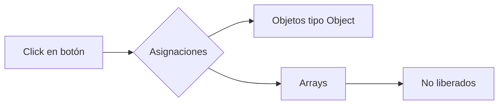

La herramienta **Allocation instrumentation on timeline** del panel **Memory** en DevTools permite **rastrear asignaciones de memoria en tiempo real** mientras interactúas con tu aplicación.

---

## ¿Para qué sirve?

Esta herramienta responde preguntas como:

- ¿Cuándo y dónde se están creando objetos?
- ¿Qué operaciones del usuario generan más asignaciones?
- ¿Qué objetos no están siendo recolectados?

---

##  ¿Cómo se usa?

1. Abre DevTools (`F12` o `Ctrl + Shift + I`).
2. Ve a la pestaña **Memory**.
3. Selecciona la opción **Allocation instrumentation on timeline**.
4. Haz clic en **Start** para comenzar a grabar.
5. Interactúa con tu aplicación.
6. Haz clic en **Stop** para finalizar el registro.

---

## ¿Qué muestra el resultado?

Una vez grabado, verás:

- Un gráfico de barras con **eventos de asignación** de memoria.
- Una lista de **tipos de objetos** asignados.
- Columnas como `Count`, `Size`, y **retained size**.

Puedes hacer clic en un objeto para explorar su **retained tree**, ver dónde fue creado y por qué sigue en memoria.

---

## Ejemplo de uso

Supongamos que haces clic en un botón varias veces y notas un aumento constante de memoria.

```javascript
document.querySelector("#boton").addEventListener("click", () => {
  const lista = [];
  for (let i = 0; i < 1000; i++) {
    lista.push({ valor: i });
  }
});
```

Si lista no se libera, verás múltiples asignaciones creciendo sin ser recolectadas.

## Captura visual (ejemplo ilustrativo)


🔍 DevTools mostrará muchas instancias de objetos tipo Object y Array, indicándote si están siendo retenidos.

###  ¿Cómo detectar fugas?  
- Observa objetos que se mantienen tras detener la grabación.  
- Fíjate en los que tienen alto **retained size**.  
- Haz clic derecho y selecciona *"Reveal in Summary view"* para investigar más a fondo.  

### Buenas prácticas  
- Usa esta herramienta mientras interactúas con la app.  
- Realiza grabaciones **cortas y controladas**.  
- Libera referencias manualmente para probar si los objetos desaparecen.  
- Úsala en combinación con **heap snapshots** y **retained tree**.  

### Recursos adicionales  
- **DevTools Docs:** [Allocation instrumentation](https://developer.chrome.com/docs/devtools/)  
- **Artículo:** [Cómo detectar fugas de memoria en tiempo real (Google)](https://developers.google.com/)  