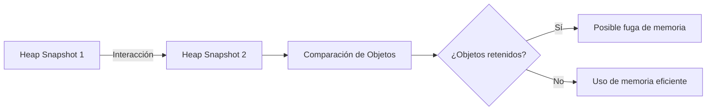

# Comparación de Snapshots de Memoria

Cuando tomas múltiples **heap snapshots**, puedes compararlos para detectar **fugas de memoria**, **objetos persistentes**, y analizar cómo cambian los objetos en el tiempo.

Esta comparación es clave para encontrar problemas difíciles de detectar, como **referencias que no se liberan**.

---

## 📊 ¿Qué es la comparación de snapshots?

Es una funcionalidad que permite ver:

- Qué objetos fueron **creados** entre snapshots.
- Cuáles **desaparecieron**.
- Cuáles **aumentaron o disminuyeron** su uso de memoria.

Esto ayuda a identificar **objetos retenidos innecesariamente**.

---

## 🧪 ¿Cómo hacerlo?

1. Abre la pestaña **Memory**.
2. Selecciona **Heap snapshot**.
3. Toma una snapshot antes de una acción.
4. Realiza una interacción en tu app (por ejemplo, abrir un modal).
5. Toma otra snapshot.
6. Ahora, selecciona la segunda snapshot y elige **Compare with previous**.

DevTools te mostrará una vista comparativa.

---

## 📈 Vista comparativa

En la vista de comparación se muestran columnas clave:

```markdown
| Objeto           | Delta de objetos | Delta de tamaño |
|------------------|------------------|-----------------|
| `ModalComponent` | +3               | +10 KB          |
| `EventListener`  | +5               | +15 KB          |
| `Image`          | 0                | 0 KB            |
```
🔍 Busca objetos con deltas positivos que **no desaparecen** entre interacciones.

---

## 🔥 Diagrama explicativo



## 🛠️ Ejemplo práctico (JS)
```js
function crearListeners() {
  const btn = document.getElementById('boton');
  btn.addEventListener('click', () => {
    console.log('Click!');
  });
}
crearListeners();
```
Si `crearListeners()` se ejecuta muchas veces sin remover los listeners previos, estos quedarán en memoria, y al comparar snapshots, los `EventListener` seguirán creciendo.

✅ **Buenas prácticas**  
- Toma snapshots con el botón de **garbage collection** activado (el ícono de 🗑️).  
- Usa nombres descriptivos para objetos y clases.  
- Compara después de interacciones específicas.  
- Filtra por objetos con **retained size** alto o conteo creciente.  

📚 **Recursos útiles**  
- [Documentación oficial de Chrome DevTools – Memory](https://developer.chrome.com/docs/devtools/memory/)  
- [Video explicativo de fugas de memoria (Google DevTools)](https://youtube.com/watch?v=ejV7YV_M3aE)  